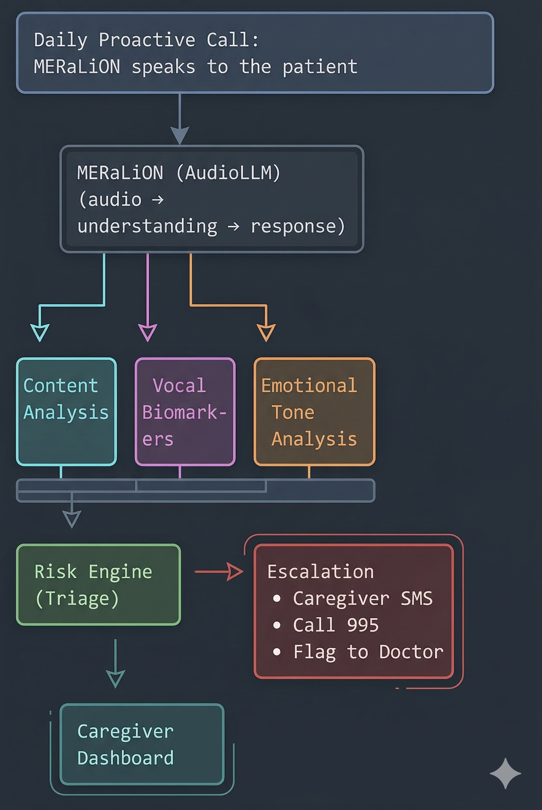

# HealthLah Companion 🤝

**Every conversation is a care intervention.**

A proactive, voice-first AI health companion powered by
MERaLiON AudioLLM that calls elderly patients in their
preferred language, conducts natural daily check-ins, detects
health deterioration through vocal cues, and bridges the
communication gap between patients, caregivers, and doctors.

> Built for the NUS–SYNAPXE–IMDA AI Innovation Challenge 2026
> Theme: *Empower Patients, Enable Community, Elevate Healthcare*

---

## 🤔 The Problem

In Singapore, **1.8 million people** live with diabetes,
hypertension, or high lipid levels — many unaware of their
condition. For elderly patients like Mr. Tan (67, diabetic,
hypertensive), managing health means:

- 💊 Remembering multiple daily medications
- 📅 Keeping track of specialist appointments
- 🏥 Recognising warning symptoms early enough to act
- 😔 Coping with isolation and declining mobility

Most health apps assume users can **type, read small text,
and navigate complex UIs**. Mr. Tan speaks Mandarin at home,
struggles with smartphones, and lives alone.

**HealthLah meets him where he is — through voice.**

---

## 💡 The Solution

HealthLah is an AI companion that **proactively calls**
patients — not the other way around.

| What it does | How |
|---|---|
| 📞 Daily voice check-ins | Calls patient at their preferred time |
| 🗣️ Speaks their language | Mandarin, Malay, Tamil, English, Singlish |
| 💊 Medication adherence | Gently asks and tracks compliance |
| 🩺 Symptom screening | Detects health concerns from conversation |
| 🎵 Vocal biomarker analysis | Catches breathlessness, slurring, tremor |
| 😊 Emotional wellbeing | Detects loneliness, confusion, distress |
| 🚨 Smart escalation | Alerts caregivers or 995 when needed |
| 📋 Caregiver dashboard | English summaries of each check-in |

---

## 🏗️ Architecture



## 🔧 Tech Stack

| Component | Technology |
|---|---|
| Audio LLM | MERaLiON AudioLLM |
| Text-to-Speech | Edge TTS (multilingual) |
| Backend | FastAPI (Python) |
| Frontend | HTML/JS (browser-based demo) |
| Scheduling | APScheduler |

---

## 🚀 Quick Start

```bash
git clone https://github.com/kilojoules-kj/HealthLah-Companion.git
cd healthlah-companion
pip install -r requirements.txt
python main.py
# Open http://localhost:8000
